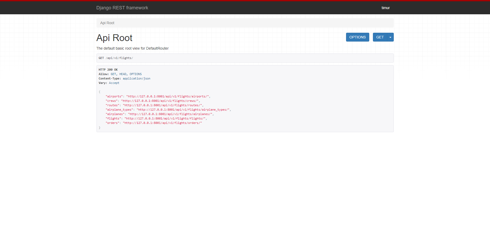

# Airport-API-Service

Welcome to the API Airport Service for Airport Management!

Our API Airport Service is a comprehensive solution designed to manage airport operations efficiently. Built using Django and Django Rest Framework (DRF) with a PostgreSQL database, this service offers robust functionality and scalability to meet the needs of modern airport management.

# Features
- JWT authentication
- Admin panel
- Comfortable documentation
- Managing orders and tickets
- Creating airport, crew, airplane type
- Creating route, airplane, flights
- filtering routes by source and destination
- Throttling
- Pagination
- Docker and docker-compose
- PostgreSQL
- Permissions

# Installing using GitHub
Install PostgreSQL and create db
```sh
# Clone the repository
git clone https://github.com/Timur5050/Airport-API-Service.git
# Change to the project directory
cd Airport-API-Service
# Create a virtual environment
python -m venv venv
# Activate the virtual environment
# On Windows
venv\Scripts\activate
# On macOS/Linux
source venv/bin/activate
# Install required packages
pip install -r requirements.txt
SET POSTGRES_DB=<your db name>
SET POSTGRES_USER=<your db username>
SET POSTGRES_PASSWORD=<your db password>
SET POSTGRES_HOST=<your db host>
SET POSTGRES_POST=<your db 5432>
SET PGDATA=/var/lib/postgresql/data
# Apply migrations
python manage.py migrate
# Run the development server
python manage.py runserver
# Open the project in your web
# Go to http://127.0.0.1:8000/
```

# Run with docker
Docker should be installed
```sh
# Clone the repository
git clone https://github.com/Timur5050/Airport-API-Service.git
# Change to the project directory
cd Airport-API-Service
# build docker compose
docker-compose build
# then start containers
docker-compose up
# Open the project in your web
# Go to http://127.0.0.1:8001/
```

# Getting access
- create user via /api/user/register/
- get access token via api/user/token/

# Full documentation
Get in Browser:
<br>
http://127.0.0.8000/api/docs/ or http://127.0.0.8001/api/docs/ for docker-compose
<br>
Download it:
<br>
http://127.0.0.8000/api/schema/ or http://127.0.0.8001/api/schema/ for docker-compose

# demo

